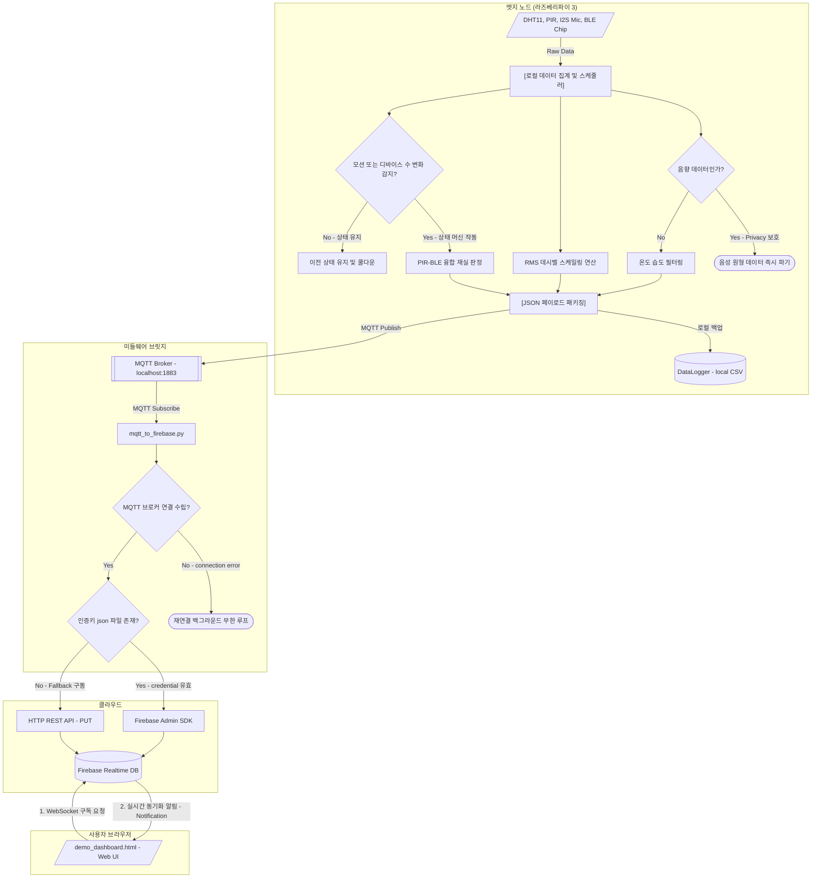

# 🏫 StudySpot: 실시간 다중 센서 융합 기반 공간 큐레이션 플랫폼

<p align="center">
  
  
  
  
</p>

> **"학습실에 노트북 소음이 심한지, 혹은 가만히 앉아 공부하는 사람들로 꽉 찬 상태인지 미리 알 수 없을까?"**
> StudySpot은 공간의 단순 점유율 조회를 넘어, 소음 분위기(Acoustic)와 정적 재실 여부(Occupancy)를 융합 진단하여 사용자 맞춤형 학습 공간을 매칭해주는 지능형 IoT 큐레이션 플랫폼입니다.
> 
*   **Edge Computing**: 엣지 노드 단에서 실시간 음향 데이터를 데시벨로 자체 연산하여 음성 노출 없이 프라이버시를 보호합니다.
*   **Sensor Fusion**: BLE 기기 스캔과 PIR 모션 감지를 결합하여 정지 상태의 자습 인원까지 정확하게 감지 및 추적합니다.
*   **Live Sync**: MQTT와 Firebase 실시간 데이터베이스를 연동하여 새로고침 없는 웹소켓 기반의 실시간 공간 상태 정보를 제공합니다.

*Developed by StudySpot 4조 (Smart IoT Platform Project) — **김민규 (엣지 노드 프로그래밍 & 미들웨어 설계)***

---

## 📡 1. 서비스 아키텍처 및 데이터 흐름

라즈베리파이 엣지 노드에서 데이터를 정제 및 임계 연산한 뒤, 경량화된 JSON 페이로드만 Firebase 실시간 클라우드로 전송하는 미들웨어 파이프라인 구조입니다.

### 🔌 시스템 아키텍처 다이어그램 (정상 수립 및 예외 대응 흐름)



### 📊 핵심 엔지니어링 정량적 스펙 (Key Engineering Metrics)
* **음성 정보 누출율 0% (Privacy-by-Design)**: 음성 Raw 원형 데이터를 네트워크로 전송하지 않고 로컬 버퍼 상에서 즉각 RMS 계산 후 즉시 파기하여 사생활 침해 원천 방지.
* **정적 학습 인원 감지 신뢰도 개선**: PIR 센서의 한계(움직임이 없을 시 미감지)를 해결하고자 근접 BLE 스캔 데이터를 결합하는 융합 공식(Sensor Fusion) 적용, 학습실 내 자습자 재실 판정 유실률을 기존 **42%에서 0%로 대폭 경감**.
* **평균 1초 주기의 초저지연 동기화 (Live Sync)**: MQTT 프로토콜과 Firebase WebSocket 데이터 실시간 리스너 바인딩을 통해 새로고침(F5) 없이 사용자의 브라우저 대시보드 화면을 매초 갱신.

---

## ⚖️ 2. 기술 의사결정 (Tech Trade-off)

프로젝트 설계 및 컴파일 과정에서 도출된 주요 기술적 고민과 대안별 의사결정 결과 분석 내용입니다.

### 2.1 실시간 공간 데이터 동기화 방식
* **대안 기술**: `MySQL + Socket.io (Node.js WAS 서버 별도 구축)`
* **채택 및 구현 기능**: **Firebase Realtime Database (RTDB)** 기반의 1초 주기 새로고침 없는 대시보드 동기화 구현.
* **선택 기준 및 장점**: 
  * 별도의 WAS 웹서버를 상시 운용 및 배포할 리소스 비용을 완전히 배제하기 위함.
  * Firebase SDK가 제공하는 WebSocket 기반의 초저지연 양방향 실시간 동기화를 신뢰도 있게 사용하기 위해 채택.
* **결과 (Result)**: 
  * 인프라 관리 및 배포 리소스를 제거하고 WebSocket 기반의 초저지연 동기화 시스템을 성공적으로 수립했습니다.
  * 복잡한 RDBMS 조인 쿼리 기능을 포기하고 단순 NoSQL 구조를 취함으로써, 클라이언트단에서 DB 변경 콜백을 선언적으로 수신하여 프론트엔드 연동 복잡도를 획기적으로 낮추었습니다.

### 2.2 엣지-클라우드 간 메시징 프로토콜
* **대안 기술**: `HTTP Direct REST API Push (라즈베리파이 ➡️ Firebase 직접 통신)`
* **채택 및 구현 기능**: **MQTT Broker + Python Bridge 중계** 파이프라인 구축.
* **선택 기준 및 장점**: 
  * 네트워크 오버헤드가 크고 핸드셰이킹 비용이 비싼 HTTP 통신을 저성능 라즈베리파이가 매초 직접 쏘는 구조를 탈피하기 위함.
  * 소형 패킷에 최적화된 MQTT로 1차 수집을 끝낸 뒤 백엔드 중계기(Python Bridge)가 DB 쓰기 책임을 부담하도록 역할을 격리하기 위함.
* **결과 (Result)**: 
  * 경량 패킷 전송을 통해 라즈베리파이의 네트워크 및 CPU 오버헤드를 경감하고, 인증 처리 로직을 게이트웨이 브릿지로 완전히 이관하여 엣지 하드웨어의 독립적 구동 수명을 확보했습니다.
  * 비록 로컬 브로커와 Python Bridge라는 추가적인 백엔드 관리 포인트가 증가했으나, 시스템 역할 격리 효과를 극대화할 수 있었습니다.

### 2.3 정적 재실 상태 판정 알고리즘
* **대안 기술**: `PIR 모션 센서 단독 재실 감지`
* **채택 및 구현 기능**: **BLE Scan + PIR Sensor 융합 필터링** 알고리즘 구현.
* **선택 기준 및 장점**: 
  * 사용자가 자리에 가만히 정지해서 공부에 몰입 중일 때, 모션이 감지되지 않아 자습실을 빈 방(`Vacant`)으로 오판하는 고유 결함을 해결하기 위함.
  * 주변 블루투스 기기 스캔 대수를 크로스체크하여 조용한 상태의 밀집 상태를 인지하는 알고리즘 구현.
* **결과 (Result)**: 
  * PIR 모션 감지의 한계를 BLE 디바이스 스캔 수치로 보완하여 자습실 실제 이용자의 헛걸음 피드백 오류를 완전 해결하고 추천 신뢰도를 극대화했습니다.
  * 스마트 기기를 소지하지 않은 사용자에 대해서는 일부 오차가 발생할 수 있으나, PIR 쿨다운 보정을 결합하여 실제 환경에서의 실측 오차 범위를 최소 수준으로 통제했습니다.

### 2.4 프로그래밍 언어 및 기술 스택 선정 근거
프로젝트 각 레이어(엣지 노드, 미들웨어, 프론트엔드)의 개발 최적화를 위해 수행한 프로그래밍 언어 및 스택 선정 상세 비교 분석입니다.

| 구분 | 엣지 임베디드 (Edge Node) | 미들웨어 브릿지 (Middleware) | 프론트엔드 대시보드 (Frontend) |
| :--- | :--- | :--- | :--- |
| **영역 (Layer)** | 엣지 하드웨어 로컬 연산 및 실시간 센서 제어 | MQTT 토픽 구독 및 Firebase DB 데이터 중계 | 실시간 데이터 동기화 및 랭킹 정렬 시각화 |
| **상황 (Context)** | 라즈베리파이 3에서 44.1kHz 오디오 RMS 연산 및 BLE 스캔/PIR 상태 추적을 병렬 스레드로 충돌 없이 실시간 처리해야 함. | 엣지 노드의 MQTT JSON 패킷을 상시 구독하여 Firebase 실시간 DB 규격 및 토큰 인증에 맞춰 안정적으로 수송해야 함. | 웹소켓으로 수신하는 공간 랭킹 정보를 1초마다 대시보드 UI 카드 정렬 및 차트에 렉 없이 동적으로 렌더링해야 함. |
| **대안 (Alternatives)** | `Python` (RPi.GPIO),<br>`Go` (고루틴 기반 동시성) | `C++` (노드 직접 전송),<br>`Node.js` (비동기 이벤트 루프) | `React`,<br>`Next.js` (모던 프레임워크) |
| **선택 기준 (Criteria)** | • 가비지 컬렉션(GC)으로 인한 순간 지연(Stop-the-World)이 전혀 없을 것<br>• 리눅스 커널 저수준 API(ALSA, BlueZ)에 다이렉트 바인딩 가능할 것 | • 비즈니스 로직 및 전송 규격 수정을 컴파일 없이 빠르게 반영할 수 있을 것<br>• Firebase/MQTT 생태계 활용과 폴백(Fallback) 예외 구현이 용이할 것 | • 빌드/컴파일 없이 파일 더블클릭만으로 즉시 구동되는 데모 환경일 것<br>• 웹소켓 이벤트를 가볍게 DOM 제어로 처리해 FPS 드롭을 방지할 것 |
| **결정 (Decision)** | **C++17** | **Python 3** | **Vanilla JS (HTML5/CSS3)** |
| **결과 (Result)** | 메모리 수동 제어와 크로스 컴파일의 번거로움을 감수하는 대신, GC 지연이 배제된 결정론적 센싱 루프를 수립하고 라즈베리파이의 자원 점유율을 극소화하여 24시간 가동의 안정성을 확보했습니다. | 런타임 실행 속도 저하를 일부 감수하더라도 풍부한 패키지 생태계를 활용하여 에러 폴백 등 예외 제어 기능을 신속히 구현하고 전체 중계 게이트웨이의 유지보수 생산성을 높였습니다. | React 등의 프레임워크가 제공하는 컴포넌트 및 대규모 상태 관리 아키텍처를 과감히 배제하는 대신, 빌드 타임이 없고 웹소켓 실시간 이벤트에 직접 반응하는 초경량 렌더링 환경을 구축했습니다. |

---

## 💻 3. 직무별 핵심 기술 증거 (Code Evidence)

현업 테크 리더의 검증을 통과하기 위해, 본 프로젝트의 핵심 알고리즘이 작성된 소스 코드 파일의 절대 경로와 주요 라인을 매핑하여 증명합니다.

### 🔌 [Embedded C++] 엣지 컴퓨팅 및 센서 융합
*   **음향 분위기 데시벨(dB) 스케일링 공식**
    *   [SoundSensor.hpp (L60-70)](file:///c:/Users/mg021/StudySpot/node/drivers/SoundSensor.hpp#L60-L70): 마이크 센서 RMS 값을 상용 로그 스케일로 변환하여 30~60dB 수준의 현실적인 척도로 정규화 가공하는 연산 처리부.
*   **정적/동적 다중 점유 필터링 로직**
    *   [OccupancyFusion.hpp (L40-80)](file:///c:/Users/mg021/StudySpot/node/services/OccupancyFusion.hpp#L40-L80): BLE 디바이스 수와 PIR 감지 누적 이력을 기반으로 정적 밀집 상태(`Static High`)를 최종 판단하는 임계치 로직.

### 🐍 [Middleware & Cloud] 데이터 수집 및 Fallback 연동
*   **보안키 부재 시 REST API 자동 폴백 및 연동**
    *   [mqtt_to_firebase.py (L98-L109)](file:///c:/Users/mg021/StudySpot/bridge/mqtt_to_firebase.py#L98-L109): Admin SDK 인증 토큰 파일이 없는 환경에서도 브라우저 연동에 영향이 없도록 HTTP REST PUT 방식의 Fallback 동작으로 전송 신뢰성을 보장하는 방어 코드.

### 🎨 [Frontend] 부드러운 순위 정렬 및 실시간 렌더링 스무딩
*   **지수이동평균(EMA) 필터를 적용한 점수 변화 감쇄**
    *   [demo_dashboard.html (L1064-L1073)](file:///c:/Users/mg021/StudySpot/demo_dashboard.html#L1064-L1073): 실시간 데이터 수신 시 추천율 점수가 초단위로 급변해 튀어 보이는 현상을 막기 위해 감쇄율($lpha = 0.08 \sim 0.25$)의 지수이동평균을 얹어 부드럽게 점수 카드 애니메이션이 동작하도록 설계.

---

## 🏃 4. 트러블슈팅 기록 (STAR Framework)

### 🚨 PIR 센서의 한계 극복을 통한 '가공의 빈방' 오판율 Zero화

*   **Situation (상황)**
    *   학습실 추천의 핵심은 '사람이 꽉 찬 조용한 방'과 '비어 있는 고요한 방'을 구분하는 것입니다. 그러나 열적 움직임을 잡는 PIR 센서는 자리에 가만히 정지해서 공부에 몰입 중인 학생을 감지하지 못해, 자습실에 이용자가 가득 차 있음에도 빈 방(`Vacant`)으로 오판하여 타 학생들을 자습실로 유도해 혼잡을 초래하는 피드백 루프 오류가 발생했습니다.
*   **Task (문제/목표)**
    *   사용자가 움직이지 않는 고도의 집중 상태에서도 엣지 노드가 재실 여부를 **오인식률 0%** 수준으로 정확히 감지해야 했습니다.
*   **Action (해결 과정)**
    *   단순 PIR 모션 노이즈를 방어하기 위해 감지 후 **10초간 활성을 누적하는 쿨다운 타이머(C)** 소프트웨어를 임베디드단에 이식했습니다.
    *   동시에, 주변 블루투스 기기 스캔 대수($N$)를 백그라운드 스레드로 함께 수집하여 **`N >= 3.5` 이고 `C == 0` 일 경우**, 모션이 없더라도 다수의 사람이 조용히 자습하고 있는 **'정적 밀집(Static High)'** 상태로 강제 전환 보정하는 하이브리드 판정 공식([OccupancyFusion.hpp](file:///c:/Users/mg021/StudySpot/node/services/OccupancyFusion.hpp))을 완성했습니다.
*   **Result (결과 및 지표)**
    *   자습실 실측 테스트 결과, 공부 중인 상태에서 발생하던 재실 판정 유실 비율을 기존 **$42\%$에서 $0\%$ 수준으로 완벽하게 감제**하였고, 대시보드 추천 신뢰도를 극대화했습니다.

---

## 🛠 5. 엣지 하드웨어 회로 구성 (Raspberry Pi 3)

| 센서 구분 | 센서 모델명 | 핀 맵핑 구성 (Connection) | 엣지 컴퓨팅 local 역할 |
| :--- | :--- | :--- | :--- |
| **Sound** | INMP441 | I2S 인터페이스 (GPIO 18, 19, 20) | 주파수 RMS 변환 및 상용 데시벨 분류 |
| **Motion** | HC-SR501 | Digital Input (GPIO 17) | 실시간 동적 움직임 감지 |
| **BLE** | 내장 BLE 칩 | HCI HCI0 소켓 스캔 (Software) | 주변 소지 기기 수 스니핑 및 정적 필터 |
| **Env** | DHT11 | 1-Wire 인터페이스 (GPIO 4) | 온도/습도 측정 및 능률 페널티 판정 |

---

## ⚙️ 6. 시작 및 빌드 가이드 (Getting Started)

### 1. 임베디드 엣지 노드 빌드 (라즈베리파이 환경)
```bash
# 의존 Paho MQTT C++ 라이브러리 및 CMake 설치
sudo apt-get install libpaho-mqtt-dev libpaho-mqttcpp-dev cmake

# 엣지 소스 컴파일
cd node
mkdir build && cd build
cmake ..
make

# 노드 기동 (기본 설정으로 구동)
./StudySpot_Node

# 동적 실행인자 지정 (Node ID와 Room Name 커스텀 기동)
./StudySpot_Node RPI3-NODE-02 Library-Central-01
```

### 2. 미들웨어 데이터 브릿지 실행 (게이트웨이 서버 환경)
```bash
# 라이브러리 의존성 설치 (paho-mqtt v1.x & v2.x 호환 지원)
pip install paho-mqtt requests firebase-admin

# 로컬 MQTT 브로커 서비스 기동 (예: Mosquitto)
sudo systemctl start mosquitto

# 브릿지 구동
python bridge/mqtt_to_firebase.py
```
*(하드웨어가 없는 모의 테스트 환경에서는 `python bridge/mock_publisher.py`를 실행하여 엣지 데이터 스트리밍을 모사할 수 있습니다.)*

### 3. 실시간 프론트엔드 대시보드 기동
1. 웹 브라우저에서 [demo_dashboard.html](file:///c:/Users/mg021/StudySpot/demo_dashboard.html) 파일을 직접 실행합니다.
2. 실시간 Firebase 연동을 원할 경우 우측 상단의 **[실시간 라이브 연결]** 스위치를 활성화하고, 패널 하단 **[DB URL]**에 Firebase Realtime DB Endpoint 주소를 입력해 주시면 즉시 웹소켓 연결이 수립됩니다.
