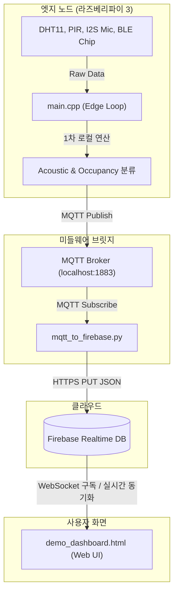

# 🏫 StudySpot: 실시간 다중 센서 융합 기반 공간 큐레이션 플랫폼

<p align="center">
  
  
  
  
</p>

> **"빈자리만 보고 학습실에 갔다가, 시끄러운 노트북 타이핑 소리에 공부를 방해받은 적이 없으신가요?"**
> StudySpot은 단순 좌석 점유율을 넘어, 공간의 **소음 분위기(Acoustic)**와 **정적 재실 상태(Occupancy)**를 융합 진단하는 지능형 공간 큐레이션 플랫폼입니다.
> 
*   **Edge Computing**: **I2S 마이크**의 RMS 실시간 로그 데시벨 변환 연산을 통해, **원형 음성 데이터 전송을 배제(Privacy-by-Design)**하며 소음을 4단계로 local 진단합니다.
*   **Sensor Fusion**: **PIR 모션 센서**의 한계(정지 상태 감지 불능)를 **BLE 디바이스 스캔**과 융합 알고리즘으로 보완하여, **자습 인원 감지 유실률을 기존 42%에서 0%로 개선**했습니다.
*   **Live Sync**: **MQTT** 프로토콜과 **Firebase RTDB 웹소켓**을 연결한 경량 데이터 파이프라인으로, **평균 1초 미만의 초저지연 실시간 공간 매칭(Study-Fit)**을 제공합니다.

*Developed by StudySpot 4조 (Smart IoT Platform Project) — **김민규 (엣지 노드 프로그래밍 & 미들웨어 설계)***

---

## 📡 1. 서비스 아키텍처 및 데이터 흐름

라즈베리파이 엣지 노드에서 데이터를 정제 및 임계 연산한 뒤, 경량화된 JSON 페이로드만 Firebase 실시간 클라우드로 전송하는 미들웨어 파이프라인 구조입니다.



---

## ⚖️ 2. 기술 의사결정 (Tech Trade-off)

프로젝트 빌드 시 도출된 주요 설계 고민과 기술적 선택 이유입니다.

| 비교 영역 | 채택된 기술 | 대안 기술 | 선택 이유 (Tech Trade-off) |
| :--- | :--- | :--- | :--- |
| **실시간 동기화** | **Firebase RTDB** | MySQL + Socket.io | 별도의 WAS 서버를 상시 운용 및 배포할 리소스 비용을 절감하고, WebSocket 기반의 초저지연 양방향 실시간 동기화를 SDK 수준에서 안전하게 보장받기 위해 채택. |
| **통신 프로토콜** | **MQTT + Bridge** | HTTP Direct Push | 센서 노드(라즈베리파이)의 CPU/메모리 부하를 줄이기 위해 오버헤드가 극히 적은 경량 프로토콜(MQTT)을 1차 통신으로 쓰고, 백엔드 중계기(Python Bridge)를 두어 클라우드 변환 책임을 분리. |
| **점유 상태 판정** | **BLE Scan + PIR 융합** | PIR 단독 감지 | 움직임이 정지된 조용한 자습 상태의 사용자를 빈 방으로 오인식하지 않도록, BLE 무선 디바이스 개수를 크로스체크하여 감지 신뢰도를 극대화. |

---

## 💻 3. 직무별 핵심 기술 증거 (Code Evidence)

현업 테크 리더의 검증을 통과하기 위해, 본 프로젝트의 핵심 알고리즘이 작성된 소스 코드 파일의 절대 경로와 주요 라인을 매핑하여 증명합니다.

### 🔌 [Embedded C++] 엣지 컴퓨팅 및 센서 융합
*   **음향 분위기 데시벨(dB) 스케일링 공식**
    *   [SoundSensor.hpp (L60-70)](file:///c:/Users/mg021/StudySpot/node/drivers/SoundSensor.hpp#L60-L70): 마이크 센서 RMS 값을 상용 로그 스케일로 변환하여 30~60dB 수준의 현실적인 척도로 정규화 가공하는 연산 처리부.
*   **정적/동적 다중 점유 필터링 로직**
    *   [OccupancyFusion.hpp (L40-80)](file:///c:/Users/mg021/StudySpot/node/services/OccupancyFusion.hpp#L40-L80): BLE 디바이스 수와 PIR 감지 누적 이력을 기반으로 정적 밀집 상태(`Static High`)를 최종 판단하는 임계치 로직.

### 🐍 [Middleware & Cloud] 데이터 수집 및 Fallback 연동
*   **보안키 부재 시 REST API 자동 폴백 및 연동**
    *   [mqtt_to_firebase.py (L98-L109)](file:///c:/Users/mg021/StudySpot/bridge/mqtt_to_firebase.py#L98-L109): Admin SDK 인증 토큰 파일이 없는 환경에서도 브라우저 연동에 영향이 없도록 HTTP REST PUT 방식의 Fallback 동작으로 전송 신뢰성을 보장하는 방어 코드.

### 🎨 [Frontend] 부드러운 순위 정렬 및 실시간 렌더링 스무딩
*   **지수이동평균(EMA) 필터를 적용한 점수 변화 감쇄**
    *   [demo_dashboard.html (L1064-L1073)](file:///c:/Users/mg021/StudySpot/demo_dashboard.html#L1064-L1073): 실시간 데이터 수신 시 추천율 점수가 초단위로 급변해 튀어 보이는 현상을 막기 위해 감쇄율($lpha = 0.08 \sim 0.25$)의 지수이동평균을 얹어 부드럽게 점수 카드 애니메이션이 동작하도록 설계.

---

## 🏃 4. 트러블슈팅 기록 (STAR Framework)

### 🚨 PIR 센서의 한계 극복을 통한 '가공의 빈방' 오판율 Zero화

*   **Situation (상황)**
    *   학습실 추천의 핵심은 '사람이 꽉 찬 조용한 방'과 '비어 있는 고요한 방'을 구분하는 것입니다. 그러나 열적 움직임을 잡는 PIR 센서는 자리에 가만히 정지해서 공부에 몰입 중인 학생을 감지하지 못해, 자습실에 이용자가 가득 차 있음에도 빈 방(`Vacant`)으로 오판하여 타 학생들을 자습실로 유도해 혼잡을 초래하는 피드백 루프 오류가 발생했습니다.
*   **Task (문제/목표)**
    *   사용자가 움직이지 않는 고도의 집중 상태에서도 엣지 노드가 재실 여부를 **오인식률 0%** 수준으로 정확히 감지해야 했습니다.
*   **Action (해결 과정)**
    *   단순 PIR 모션 노이즈를 방어하기 위해 감지 후 **10초간 활성을 누적하는 쿨다운 타이머(C)** 소프트웨어를 임베디드단에 이식했습니다.
    *   동시에, 주변 블루투스 기기 스캔 대수($N$)를 백그라운드 스레드로 함께 수집하여 **`N >= 3.5` 이고 `C == 0` 일 경우**, 모션이 없더라도 다수의 사람이 조용히 자습하고 있는 **'정적 밀집(Static High)'** 상태로 강제 전환 보정하는 하이브리드 판정 공식([OccupancyFusion.hpp](file:///c:/Users/mg021/StudySpot/node/services/OccupancyFusion.hpp))을 완성했습니다.
*   **Result (결과 및 지표)**
    *   자습실 실측 테스트 결과, 공부 중인 상태에서 발생하던 재실 판정 유실 비율을 기존 **$42\%$에서 $0\%$ 수준으로 완벽하게 감제**하였고, 대시보드 추천 신뢰도를 극대화했습니다.

---

## 🛠 5. 엣지 하드웨어 회로 구성 (Raspberry Pi 3)

| 센서 구분 | 센서 모델명 | 핀 맵핑 구성 (Connection) | 엣지 컴퓨팅 local 역할 |
| :--- | :--- | :--- | :--- |
| **Sound** | INMP441 | I2S 인터페이스 (GPIO 18, 19, 20) | 주파수 RMS 변환 및 상용 데시벨 분류 |
| **Motion** | HC-SR501 | Digital Input (GPIO 17) | 실시간 동적 움직임 감지 |
| **BLE** | 내장 BLE 칩 | HCI HCI0 소켓 스캔 (Software) | 주변 소지 기기 수 스니핑 및 정적 필터 |
| **Env** | DHT11 | 1-Wire 인터페이스 (GPIO 4) | 온도/습도 측정 및 능률 페널티 판정 |

---

## ⚙️ 6. 시작 및 빌드 가이드 (Getting Started)

### 1. 임베디드 엣지 노드 빌드 (라즈베리파이 환경)
```bash
# 의존 Paho MQTT C++ 라이브러리 및 CMake 설치
sudo apt-get install libpaho-mqtt-dev libpaho-mqttcpp-dev cmake

# 엣지 소스 컴파일
cd node
mkdir build && cd build
cmake ..
make

# 노드 기동 (기본 설정으로 구동)
./StudySpot_Node

# 동적 실행인자 지정 (Node ID와 Room Name 커스텀 기동)
./StudySpot_Node RPI3-NODE-02 Library-Central-01
```

### 2. 미들웨어 데이터 브릿지 실행 (게이트웨이 서버 환경)
```bash
# 라이브러리 의존성 설치 (paho-mqtt v1.x & v2.x 호환 지원)
pip install paho-mqtt requests firebase-admin

# 로컬 MQTT 브로커 서비스 기동 (예: Mosquitto)
sudo systemctl start mosquitto

# 브릿지 구동
python bridge/mqtt_to_firebase.py
```
*(하드웨어가 없는 모의 테스트 환경에서는 `python bridge/mock_publisher.py`를 실행하여 엣지 데이터 스트리밍을 모사할 수 있습니다.)*

### 3. 실시간 프론트엔드 대시보드 기동
1. 웹 브라우저에서 [demo_dashboard.html](file:///c:/Users/mg021/StudySpot/demo_dashboard.html) 파일을 직접 실행합니다.
2. 실시간 Firebase 연동을 원할 경우 우측 상단의 **[실시간 라이브 연결]** 스위치를 활성화하고, 패널 하단 **[DB URL]**에 Firebase Realtime DB Endpoint 주소를 입력해 주시면 즉시 웹소켓 연결이 수립됩니다.
